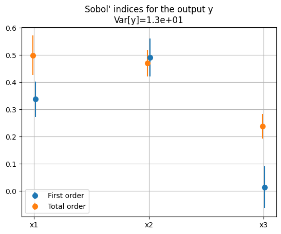
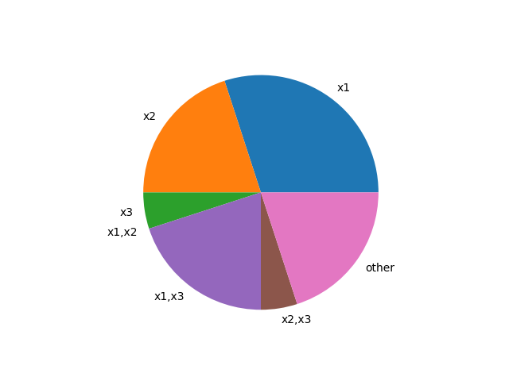
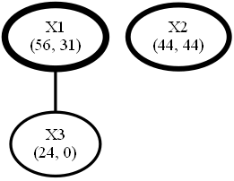

<!--
 Copyright 2021 IRT Saint Exupéry, https://www.irt-saintexupery.com

 This work is licensed under the Creative Commons Attribution-ShareAlike 4.0
 International License. To view a copy of this license, visit
 http://creativecommons.org/licenses/by-sa/4.0/ or send a letter to Creative
 Commons, PO Box 1866, Mountain View, CA 94042, USA.
-->

# Sobol' sensitivity graph

The Sobol' indices[@SOBOL2001271] are widely used in sensitivity analysis
[@saltelli2008global;@iooss2015review].

!!! info "Sobol' index"
    A Sobol' index
    represent the proportion of the variance of a quantity of interest
    explained by one or more uncertain inputs.

    The proportion explained by a single uncertain input
    is called a first-order index,
    the proportion explained by the interaction of two uncertain inputs
    is called a second-order index,
    ...
    and the proportion explained by an uncertain input
    separately or in interaction with other uncertain inputs
    is called a total-order index.

## Visualize Sobol' indices

These sensitivity indices are often represented with pie charts and bar charts.
These charts display the first-order and total-order Sobol' indices
associated with the different uncertain inputs.

The pie charts represent the first- and second-order indices as pie slices
while the bar charts represent the first- and total-order indices
with confidence intervals.

Bar charts can help to determine
whether the indices are well estimated
or whether the variance of the quantity of interest
is explained by the interaction between some uncertain inputs.



*Bar chart generated by [GEMSEO from the Ishigami function](https://gemseo.readthedocs.io/en/develop/examples/uncertainty/sensitivity/plot_sobol.html#sphx-glr-examples-uncertainty-sensitivity-plot-sobol-py).*

Pie charts can help to determine
whether interactions of order greater than 2
explain the variance of the quantity of interest.



*Pie chart generated from synthetic data.*

!!! info
    Most of the UQ libraries
    propose only first-order indices and total-order indices;
    some of them propose also the second-order indices.

## FANOVA graph

### Introduction

In the case of second-order Sobol' indices,
a FANOVA graph[@muehlenstaedt2012data] can be used
to display the interactions between the uncertain variables.
This graph is a network of uncertain variables representing their Sobol' indices:

- A node represents an uncertain variable whose name is written inside,
  followed by its first-order and total-order Sobol' indices,
- The thickness of a node
  is proportional to the total-order Sobol' index
  of the variable
  while the thickness of an edge
  is proportional to the second-order Sobol' index
  of the corresponding pair of variables.

### API

The [SobolGraph][gemseo_umdo.visualizations.sobol_graph.SobolGraph]
can be built from three dictionaries:

- the first-order indices defined as `{name: sobol_index}`,
- the second-order indices defined as `{(name, other_name): sobol_index}`,
- the total-order indices defined as `{name: sobol_index}`.

Then,
this graph can be both displayed in a window and saved on the disk:

``` py
sobol_graph = SobolGraph(first_sobol, second_sobol, total_sobol)
sobol_graph.visualize()
```



*Sobol' graph for the Ishigami function.*

!!! note
    Several examples of Sobol' graphs,
    including this one,
    can be found in a [dedicated gallery](../../generated/examples/visualizations/index.md).

Lastly,
given one or more disciplines and an uncertain space,
the
[SobolAnalysis][gemseo.uncertainty.sensitivity.sobol.analysis.SobolAnalysis]
proposed by [GEMSEO](https:///www.gemseo.org)
computes the Sobol' indices for several discipline outputs.
Then,
the [SobolGraph][gemseo_umdo.visualizations.sobol_graph.SobolGraph]
associated with a specific discipline output
can be generated from this analysis:

``` py
sobol_graph = SobolGraph.from_analysis(sobol_analysis, output_name)
sobol_graph.visualize()
```

### Options

At instantiation,
the float argument `threshold` allows to set the sensitivity threshold
above which a second-order index is declared as *significant*
and the corresponding edge plotted.

One can also change the maximum thickness of a line
with the argument `maximum_thickness`.
