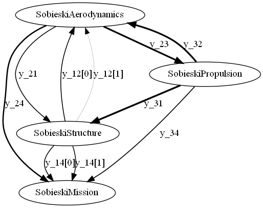

<!--
 Copyright 2021 IRT Saint Exupéry, https://www.irt-saintexupery.com

 This work is licensed under the Creative Commons Attribution-ShareAlike 4.0
 International License. To view a copy of this license, visit
 http://creativecommons.org/licenses/by-sa/4.0/ or send a letter to Creative
 Commons, PO Box 1866, Mountain View, CA 94042, USA.
-->

# Uncertain coupling graph

## Introduction

Standard sensitivity analysis[@saltelli2008global;@iooss2015review]
seeks to identify the uncertain inputs that have an impact on a model output.
Similarly,
in the case of a multidisciplinary system,
some uncertain inputs can have a more significant impact
on certain disciplines.

### Graph

Then,
the goal of the
[UncertainCouplingGraph][gemseo_umdo.visualizations.uncertain_coupling_graph.UncertainCouplingGraph]
proposed by GEMSEO-UMDO
is to identify:

- the coupling variables that are not impacted by the uncertain inputs,
- the disciplines that are not impacted by the uncertain inputs.

The nodes of this graph represent the disciplines
while the edges represent the coupling variables.

The thickness of an edge is proportional
to the absolute value of the dispersion of the corresponding coupling variable.

A node connected only by ultra-thin edges
will therefore be judged to be very insensitive
to uncertain inputs.

### Dispersion measures

The dispersion of a coupling variable is computed using a
[DispersionMeasure][gemseo_umdo.visualizations.uncertain_coupling_graph.UncertainCouplingGraph.DispersionMeasure].
GEMSEO-UMDO proposes two dispersion measures.

The
[coefficient of variation](https://en.wikipedia.org/wiki/Coefficient_of_variation)
(COV) represents
the standard deviation normalized by the mean value:

$$\textrm{COV}[Y]=\frac{\mathbb{S}[Y]}{\mathbb{E}[Y]}$$

where $\mathbb{E}[Y]$ and $\mathbb{S}[Y]$
are the expectation and standard deviation
of the random variable $Y$.
$\textrm{COV}[Y]$ tends to infinity as $\textrm{E}[Y]$ tends to 0,
which makes it sensitive to small changes in $\textrm{E}[Y]$
for values near zero.

The
[quartile coefficient of dispersion](https://en.wikipedia.org/wiki/Quartile_coefficient_of_dispersion)
(QCD)
represents the
[interquartile range](https://en.wikipedia.org/wiki/Interquartile_range)
(IQR)
normalized by the sum of the first and third quartile:

$$\textrm{QCD}[Y]=\frac{\mathbb{q}_{75\%}[Y]-\mathbb{q}_{25\%}[Y]}{\mathbb{q}_{25\%}[Y]+\mathbb{q}_{75\%}[Y]}$$

where $\mathbb{q}_{\alpha}[Y]$ is the $\alpha$-quantile of $Y$.

## API

Firstly,
the [UncertainCouplingGraph][gemseo_umdo.visualizations.uncertain_coupling_graph.UncertainCouplingGraph]
is built from
a collection of disciplines,
an uncertain space
and possibly a subset of coupling variable names.

``` py
graph = UncertainCouplingGraph(disciplines, uncertain_space)
```

Then,
the disciplines are sampled
using an [optimized Latin hypercube sampling technique](https://gemseo.readthedocs.io/en/stable/algorithms/doe_algos.html#ot-opt-lhs):

``` py
graph.sample(100)
```

!!! warning
    Setting the number of samples is mandatory.
    In the previous example, we used 100 samples.

Lastly,
this graph can be both displayed in a window and saved on the disk:

``` py
graph.visualize()
```



*Uncertainty coupling graph from the Sobieski's SSBJ problem.*

!!! note
    Several examples of uncertain coupling graphs,
    including this one,
    can be found in a [dedicated gallery](../../generated/examples/visualizations/index.md).

### Options

At the sampling stage,
the algorithm can be modified
by setting the arguments `algo_name` and `algo_options`
of the method
[sample()][gemseo_umdo.visualizations.uncertain_coupling_graph.UncertainCouplingGraph.sample].

At the visualization stage,
the string argument ``dispersion_measure``
allows to change the dispersion measure (QCD by default).

It is also possible to filter some coupling variables
with the argument ``variable_names`` (all coupling variables are displayed by default).

Lastly,
the float argument ``maximum_thickness`` can be used
to set the maximum edge thickness.
